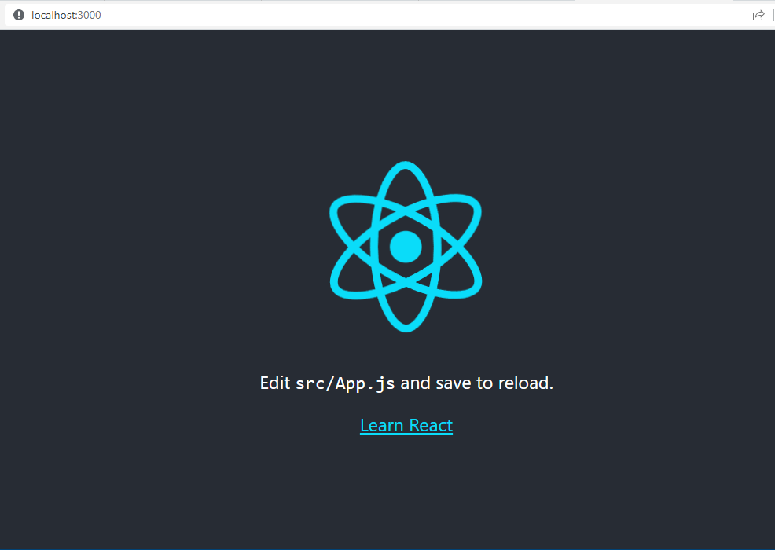

# Módulo 3 - Semana 11

Exercícios avaliativos implementados em JavaScript usando a biblioteca React.

## Scripts disponíveis

Para criar um projeto, é necessário antes disto instalar o [https://nodejs.org/en/download/](Node.js). Após instalado, execute o comando abaixo criar o projeto:

> npx create-react-app nomedoprojeto

No diretório do projeto, você pode executar:

> npm start

Executa o aplicativo no modo de desenvolvimento.\
Abra [http://localhost:3000](http://localhost:3000) para visualizá-lo em seu navegador.

A página será recarregada quando você fizer alterações.\
Você também pode ver erros de lint no console.

